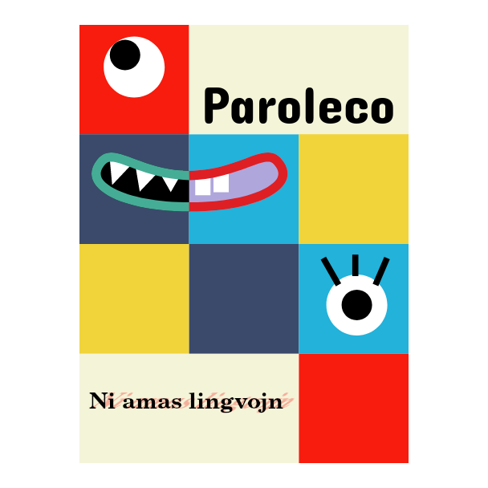
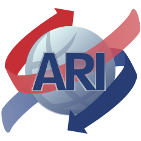
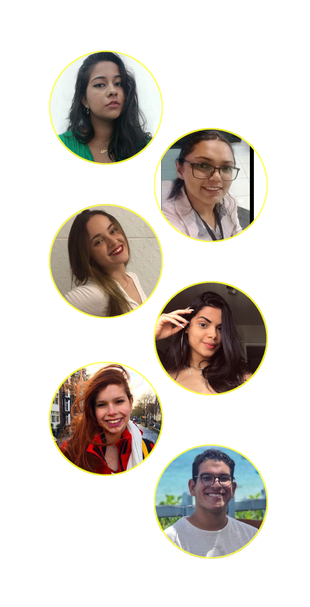

<!-- _class: lead-invert-blue -->

# Paroleco
## Language Exchange Club 
#### Ni amas lingvojn

Coordinator
Prof. Dr. Ruben C. Benante <<rcb@upe.br>>
Assessoria de Relações Internacionais 
Escola Politécnica 
Univ. de Pernambuco 
2023-07-08

---
<!-- _class: invert-purple -->

# Hi there!!

Welcome to **Paroleco** Language Exchange Club - PLEC 🌍

This is an international language exchange set of groups which was created as a way of letting people from all over the world connect and interact in order to improve whichever language they are learning. Here you will find both people studying as well as natives who will help you with any questions you may have. 

---
<!-- _class: invert-orange -->
<!-- foter: Prof. Dr. Ruben Carlo Benante <<rcb@upe.br>> -->

# História do Paroleco

- Iniciou como um hobby: 
  - colecionar amigos pelo mundo :sunglasses:
  - aprender idiomas 
- Cresceu  original :green_heart:
- Ficou um tempo unificado com o Projeto ILE :two_hearts:
- Uma certa  :shit: estragou a plataforma! Hora de reavaliar.
- O projeto de Extensão Paroleco foi reformulado. Início de uma nova era no Telegram 

---
<!-- _class: invert-red -->

# Project Goals 

- Encontrar parceiros para estudos de línguas :blue_book:
- Praticar _speaking_ :microphone: e _listening_ :headphones: com amigos de todo o mundo :earth_americas:
- Conhecer mais sobre outras culturas :performing_arts:
- Compartilhar a cultura do seu país com o mundo :brazil:

---
<!-- _class: invert -->

# How does it work?

Entre em 3 grupos (mínimo):
1. Main Lounge para papo :speech_balloon:
1. Voluntário no grupo Nativo :leftwards_arrow_with_hook:
1. Estudante no grupo de sua escolha :arrow_right_hook:

#### How to chat?!

- You may talk **only** in **_English_** **or** in the **_Language_** of the group!

:warning: Don't break this important rule!

---

<!-- _class: invert-green -->
## CoC - Code of Conduct

1. Respect other people's opinions. Express your own opinion or criticisms in a civilized, polited way. :page_with_curl:
2. Please respect different cultures, ethnicities, religions, sexuality, gender, etc. :page_with_curl:
3. Paroleco is **not** a dating platform. :page_with_curl:
4. Please avoid any kind of spamming, like advertisements, potentially dangerous links or religious propaganda. :page_with_curl:
5. Whenever you join a new group, please remember to introduce yourself. Say hi! :page_with_curl:
6. New members must talk to an admin and agree with these rules upon joining. :page_with_curl:
<!-- 6. Don't ask to add friends/family. Don't share chat links. :page_with_curl: -->

<!-- , nor send the chat links to others. -->
<!-- 7. Please don't send the links of the chats to others. --> 
<!-- They must ask an admin to join first and them the admin will send the welcome messages. Thank you. I hope you enjoy the club. -->

---
<!-- _class: invert-pink -->

# Are you interested? 

It's easy. Join our **Paroleco Lounge** 🌍 https://t.me/paroleco

- Introduce yourself: say hi, tell your name and your story!
- Join the language groups you'd like to learn;
- Join your native language group, where you will volunteer to help others.
- Respect these rules and you're gold! That's it! 

 

---
<!-- _class: invert -->

# Our Language Groups!

English 🇬🇧, Latin 📜, Spanish 🇪🇸, French 🇫🇷, Italian 🇮🇹, Portuguese 🇧🇷, German 🇩🇪,  Japanese 🇯🇵, Chinese 🇨🇳 and Russian 🇷🇺.

We will create more groups by demand, as we go along.
Please join our main group and we go from there.

Paroleco Lounge Group 🌍: https://t.me/paroleco

:chart_with_upwards_trend: Help us achieve 200 members, so we can 
move to _Telegram Topics_!

---
<!-- _class: invert-blue -->

# Paroleco Language Group Links:

Paroleco Lounge 🌍: https://t.me/paroleco

English 🇬🇧: https://t.me/joinchat/VZWOGfMJsIrtm-5W
Latin 📜: https://t.me/joinchat/Yja1_KhNnSozYjQ5
Spanish 🇪🇸: https://t.me/joinchat/KrpWTfgldxA1ZTMx
French 🇫🇷: https://t.me/joinchat/HCQ2NfjOsj5hNzcx
Italian 🇮🇹: https://t.me/joinchat/SWk49vPEW9M4ZmQx
Portuguese 🇧🇷: https://t.me/joinchat/j6nwFxiXqA84ODkx
German 🇩🇪: https://t.me/joinchat/Dh0SF0nxPIIyYTBh
Japanese 🇯🇵: https://t.me/joinchat/OQ4BNBuJBBNhMGNh
Chinese 🇨🇳: https://t.me/joinchat/dfIGmpIIa-8xOWEx
Russian 🇷🇺: https://t.me/joinchat/__2EXER5L-gxZmMx

---

# Welcome!

The exchange is based on volunteers like yourself. You join the language group you want to learn and your native language group, so you can teach and give back to the community.

We also ask you to join the main lounge, so you can meet everyone from every group. These are the three (3) minimum groups you should join, but you can join others if you are interested in learning more than one language.

We have groups for every language. You can join whichever one you want, whenever you want, just go for it!

Welcome and have a great time!

---
<!-- _class: invert-green -->
<!-- footer:     &nbsp;&nbsp;&nbsp;&nbsp;&nbsp; Ni amas lingvojn &nbsp;&nbsp;&nbsp;&nbsp;&nbsp;&nbsp;&nbsp;&nbsp;&nbsp;&nbsp;&nbsp;&nbsp;&nbsp;&nbsp;Copyright 2023+ -->

# Paroleco Project
### Coordinator
- Prof. Dr. Ruben C. Benante Dr. Bèco <<rcb@beco.cc>>
- Bel. in Computer Science
- Master in Philosophy of Mind and Cogntive Science
- Ph.D. in Artificial Intelligence
- Head of the International Relations Office at POLI/UPE

<!-- Paroleco Lounge 🌍 t.me/paroleco -->
<!-- 
&nbsp;&nbsp;&nbsp;&nbsp;&nbsp;&nbsp;&nbsp;&nbsp;&nbsp;Copyright 2023+ by Ruben Carlo Benante 
 -->

---
<!-- _class: invert-orange -->
<!-- footer:     &nbsp;&nbsp;&nbsp;&nbsp;&nbsp; Ni amas lingvojn -->

# Awesome Team

### Super Admins
- Joyce Sobral <!-- <<joyce-sobral@hotmail.com> -->
- Pedro Paim <!-- <<edro.npm@gmail.com> -->
- Bruna Hori <!-- <<brunahori19@gmail.com> -->
- Letícia Oliveira <!-- <<leticiagboliveira@gmail.com>> -->
- Cherry Tan

Paroleco Lounge 🌍 t.me/paroleco

---
<!-- _class: invert-purple -->

# Awesome Team

### Volunteers ARI/POLI/UPE

- Maria Clara de Queiroz
- Luciana Pires 
- Ana Elisa Souza
- Anne Gabriela Belarmino
- Barbara da Cunha
- José Filipe Soares

